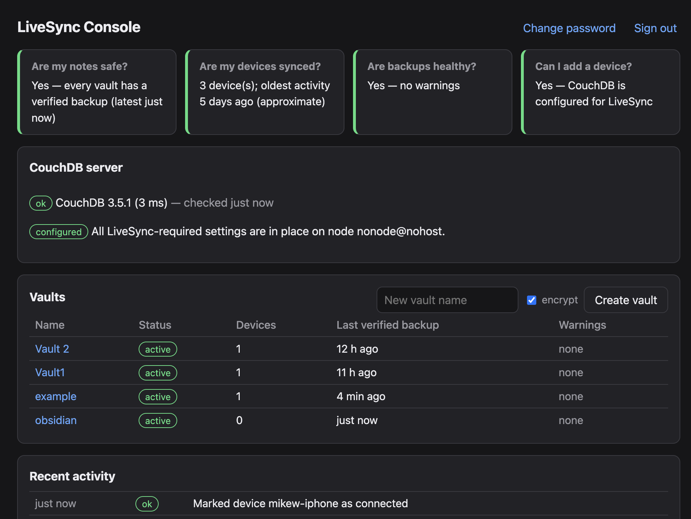
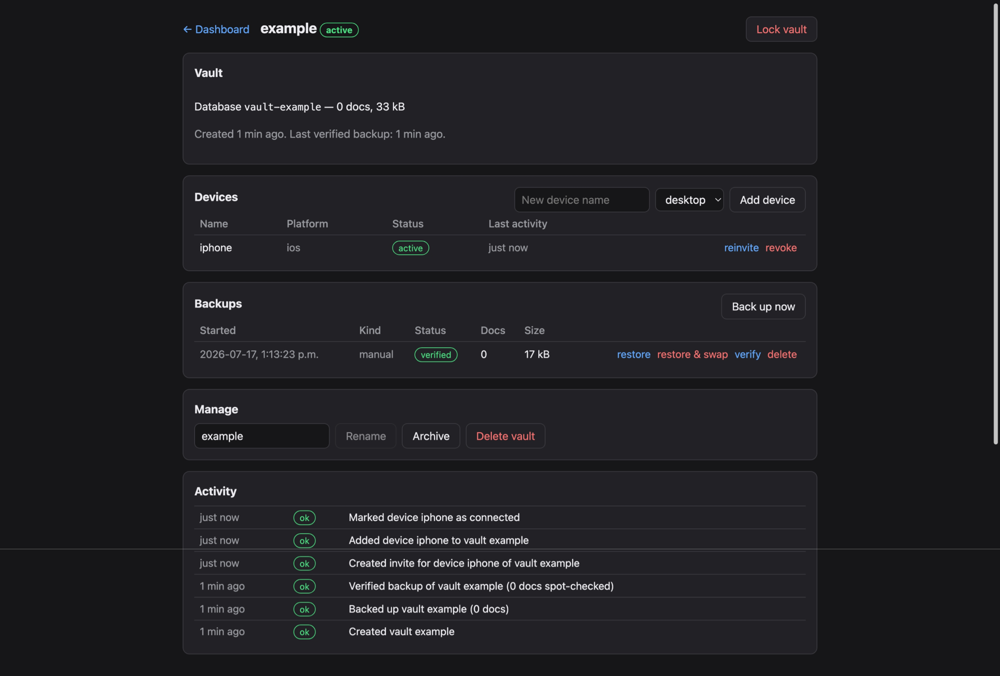

# LiveSync Manager

A self-hosted management app for [Obsidian Self-hosted LiveSync]
(https://github.com/vrtmrz/obsidian-livesync) + CouchDB. It owns the
infrastructure lifecycle (vault databases, per-device credentials,
one-click onboarding links, health monitoring, backups, and safe recovery)
so that adding a device is: open a link, enter one passphrase, watch the
vault download.

It never replaces LiveSync, never reads your notes (they're end-to-end
encrypted in CouchDB), and can itself be rebuilt from scratch without note
loss.

> **Trust model, stated up front:** to mint setup links, the app stores
> each vault's E2EE passphrase and your CouchDB admin credentials (encrypted
> at rest). A compromised host could therefore decrypt your notes.
> Run it in the same trust domain as CouchDB, your own server, not exposed
> to the public internet. Details and rationale in `docs/SECURITY.md`.

## Status

Functional (v0.3.x): vault and device lifecycle, one-click onboarding,
server configuration check/fix, verified daily backups, restore with
destructive-swap safety rails, vault lock, adoption of existing databases,
and a dashboard answering the four questions below. Runs in production
against a real CouchDB. Pre-1.0: expect rough edges; read `docs/SECURITY.md`
before trusting it with your vaults.

Documentation:

| File | Purpose |
|---|---|
| `SPEC.md` | Product requirements |
| `AGENTS.md` | Philosophy, safety rules, definition of done |
| `CLAUDE.md` | Entry point for AI-assisted development |
| `docs/ARCHITECTURE.md` | Stack, modules, data model, key decisions |
| `docs/API.md` | v1 REST surface |
| `docs/SECURITY.md` | Threat model and binding key-handling decisions |
| `docs/LIVESYNC_INTEGRATION.md` | The LiveSync/CouchDB facts everything rests on |
| `docs/DEPLOYMENT.md` | Runtime contract and Docker/Kubernetes deployment |
| `docs/RELEASING.md` | Release checklist and procedure |
| `docs/MILESTONES.md` | PR-sized implementation plan (start at M0) |
| `reference/` | Vendored upstream scripts (documentation only) |

## Quick orientation

- One CouchDB database per vault; one CouchDB user per **device** (so a lost
  phone is revoked in one click without touching other devices).
- Onboarding links are single-use, short-lived pages that carry a
  server-generated `obsidian://setuplivesync` URI, the same mechanism the
  plugin's own fly.io tooling uses, so no plugin modifications are needed.
- Two distinct secrets: the vault E2EE passphrase (long-lived) and the invite
  passphrase (minutes). See `docs/SECURITY.md` before touching either.

## License

MIT; see `LICENSE`. The scripts in `reference/` are vendored from
[vrtmrz/obsidian-livesync](https://github.com/vrtmrz/obsidian-livesync)
(MIT); see `reference/README.md` for attribution.
